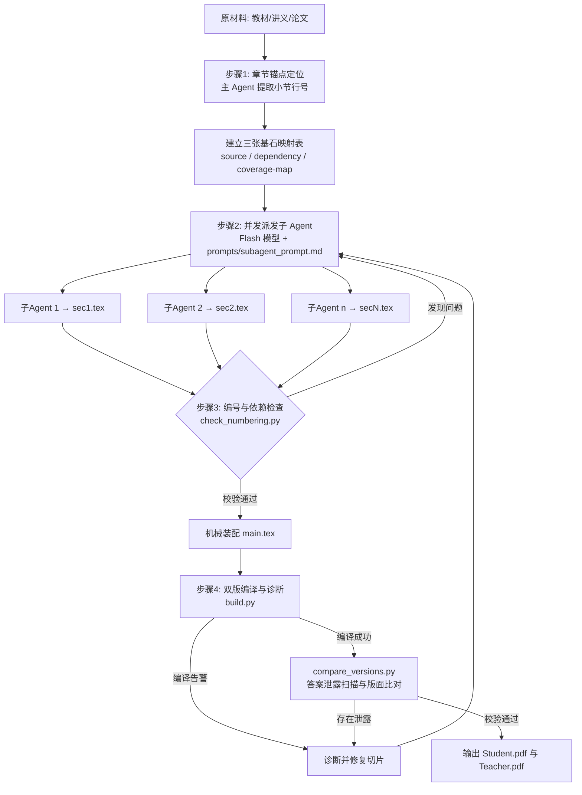

# 纯问题驱动数学自学案制作工作流 (`problem-driven-courseware`)

[](https://opensource.org/licenses/MIT)
[](https://www.latex-project.org/)
[](prompts/subagent_prompt.md)

本 Skill 专门用于将传统的数学教材、学术论文、讲义或课件，改造成以**“纯问题驱动 (Problem-Driven)”**为核心的研学案与自学文稿。

文稿采用**“单源双输出（Single-source, Dual-output）”**原则：通过 LaTeX 条件宏在同一套源文件中无缝生成：
- **学生版**：隐藏解答、留足书写白、附姓名学号栏与答题下划线；
- **教师版**：紧跟题目呈现彩色参考解答、教学要点、易错分析与评分标准。

---

## 🌟 核心理念与设计原则

纯问题驱动的核心是**“以做代讲、以做代听”**：把原材料中的陈述句改造成可操作、可观察的认知活动；但凡涉及学生无法凭既有知识操作的新对象、新运算或新记号，必须先给出最小必要定义。

```
传统教学:  定义概念 ──► 证明定理 ──► 例题示范 ──► 课后习题 (听众被动接收)
问题驱动:  直观暴露 ──► 辨认构造 ──► 反例边界 ──► 形式定义 ──► 自主证明 (学生主动建构)
```

### 1. 九大核心题型体系
1. **进入题（Entry）**：用直观熟悉的具象对象、图示或最小计算实例暴露数学现象。
2. **辨认题（Identify）**：分类、填空、判断或读图，引导学生自主捕捉并确认结构共性。
3. **构造题（Construct）**：要求学生亲自动手构造、画图、列举满足特定条件的对象。
4. **反例题（Counterexample）**：变动某一约束条件，寻找失效反例，体会条件的必要性与边界。
5. **微型知识点（Microknowledge）**：在学生完成前置探究后插入 2~3 行以内的精准定义与记号卡片。
6. **形式化题（Formalize）**：将自然语言直觉抽象为带全称量词 $\forall$、存在量词 $\exists$ 的严密数学表达。
7. **迁移题（Transfer）**：变换集合载体（如数集 $\to$ 矩阵群 $\to$ 函数空间），检验概念普适性。
8. **证明/综合题（Proof & Synthesis）**：拆解大证明为多小问（目标 $\to$ 关键等式 $\to$ 收束），引导自主完成。
9. **回看题（Review）**：一句话提炼核心判据，反思内在联系并承接下一节。

### 2. 题目状态字段 `practice_mode`
- `guided`（常规引导题）：包含微型知识点、引导语或分步小问；
- `unprompted`（无提示纯习题）：学生版只呈现自洽题干与答题留白，教师版仍配备完整解答与教学点。

### 3. 三张基石映射表（防止逻辑断裂）
- **原文骨架表 (`source-map.md`)**：溯源每个定义、记号、例题与定理的原文出处；
- **依赖关系表 (`dependency-map.md`)**：严格验证前置知识闭包，杜绝“未讲先考”；
- **覆盖与变更表 (`coverage-map.md`)**：追踪每个知识点的转化方式与删改理由。

---

## 🏗️ 工程化分层排版架构

所有新生成的文件均位于 `self/` 独立目录中，与原材料及其他过程文件解耦：

```
work_dir/
└── self/
    ├── student.tex     # 学生版编译入口 (\input{main.tex})
    ├── teacher.tex     # 教师版编译入口 (\def\TeacherVersion{}\input{main.tex})
    ├── main.tex        # 主骨架：header.tex、双栏环境、\input 各节、footer.tex
    ├── header.tex      # 纯导言区：宏包、版面参数、宏定义
    ├── footer.tex      # 收尾：双栏结束、LastPage 锚点
    ├── config.yaml     # 参数文件：纸张/边距/标题/页眉（改课程仅改此文件）
    ├── config-class.tex# 自动生成的文档类选项
    ├── config.tex      # 自动生成的 geometry 与参数宏
    ├── sec1.tex        # 第 1 节纯切片内容 (\section*{} 与 \begin{probchain})
    ├── sec2.tex        # 第 2 节纯切片内容
    └── ...
```

---

## 🛠️ 核心 LaTeX 环境与宏命令

| 宏命令 / 环境 | 作用说明 | 学生版表现 | 教师版表现 |
|---|---|---|---|
| `\qtype{题型}` | 标注题型分类 | 自动隐藏 | 显示【xx题】标签 |
| `\practicemode{unprompted}` | 标记无提示纯练习 | 隐藏标签与提示 | 显示【无提示练习】 |
| `\begin{probchain}...\end{probchain}` | 全章连续编号题链 | 统一自动递增编号 | 统一自动递增编号 |
| `\fillin[答案]{宽度}` | 挖空填空线 | 下划线空白 | 下划线上方居中蓝色加粗答案 |
| `\ansspace{高度}` | 作答书写留白 | 展开为指定高度留白 | 自动压缩为 ~0.4ex |
| `\begin{solution}...\end{solution}` | 完整参考解答 | 彻底剥离不输出 | 展开为带蓝色标题与缩进的解答 |
| `\begin{teacherNote}...\end{teacherNote}` | 教学策略与易错预警 | 彻底剥离不输出 | 醒目黄色边框批注卡片 |
| `\begin{microknowledge}[标题]...` | 2~3行微型前置定义卡片 | 实线框展示 | 实线框展示 |
| `\begin{knowledgebox}[标题]...` | 章节末核心结论框 | 虚线框展示 | 虚线框展示 |

---

## 🤖 AI 多智能体并发流水线 (Multi-Agent Pipeline)

针对长篇教材（整章/整本），采用 **Pro（全局统筹）+ Flash（极速并发）** 协作架构：



---

## 🚦 工具脚本集 (`scripts/`)

- `gen_config.py`：读取 `config.yaml` 自动生成 `config.tex` 与 `config-class.tex`；
- `check_numbering.py`：检查切片题链栈式结构、标签闭合与编号连续性；
- `build.py`：调用 XeLaTeX 双遍编译，严格核对双版本 SUMMARY 计数，拦截 Overfull 与宏包告警；
- `compare_versions.py`：对学生版 PDF 进行源级防泄露扫描，验证答案完全隔离；
- `test_examples.sh`：样例与模板回归测试套件。

---

## 📋 教师端课堂实施闭环

本仓库不仅提供文稿生成工具，还提供了完整的课堂落地实施工具链：
1. **课前准备**：利用 `templates/overview-guide.md`（章节总览）与 `templates/classroom-plan.md`（课堂计划卡）规划时间分配与三档提示（Hint 1–3）；
2. **课中推进**：遵从 `flow.md` 顺序建构流程，坚持“等待（20~40s） $\to$ 追问证据 $\to$ 提示梯度”的互动原则；
3. **课后迭代**：在 `templates/error-log.md` 记录真实卡点，按“题干不清 / 前置缺失 / 推理断裂”归因反哺下一轮学案优化。

---

## 📄 开源许可证

本项目基于 [MIT License](LICENSE) 开源。
