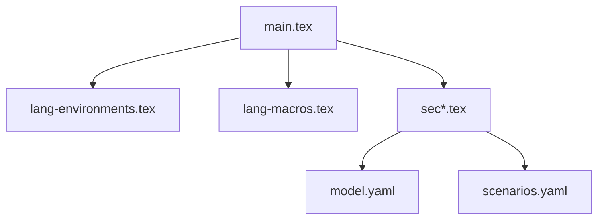

# Problem-Driven Courseware 外语学习版 - 实施指南与迁移手册

## 执行摘要

本文档记录了将 problem-driven-courseware 从数学学科成功改造为**纸笔外语学习**（Paper-and-Pencil Language Learning）形式的完整实施过程。通过本指南，您可以：

1. ✅ 理解改造的核心原理和设计决策
2. ✅ 快速部署和使用语言学习版本
3. ✅ 迁移现有数学课程到语言版本
4. ✅ 开发新的外语学习单元

---

## 一、改造概览

### 1.1 核心转变

| 维度 | 原数学版本 | 新语言版本 |
|-----|----------|-----------|
| **教学目标** | 逻辑证明能力 | 交际表达能力 |
| **输入方式** | 定理/定义阅读 | 文本阅读分析 |
| **输出方式** | 书写证明过程 | 书面语言表达 |
| **评估标准** | 唯一正确答案 | 多维度评分量表 |
| **脚手架** | 微型知识点卡 | 范文 + 短语 + 结构指南 |
| **题型体系** | 进入/辨认/构造/反例/证明 | 阅读/语法/写作/翻译 |

### 1.2 删除的组件（针对纸笔教学）

- ❌ 听力任务环境（无音频文件）
- ❌ 口语交互环境（无角色扮演对话）
- ❌ 发音训练模块
- ❌ 多媒体资源引用
- ❌ 互动式数字练习

### 1.3 新增的核心组件

#### A. 语言能力模型 (`lang-competency/model.yaml`)
```yaml
proficiency_levels:
  A1-C2: # CEFR 六级完整对标
    - reading_targets
    - writing_targets
    - vocabulary_size
    - grammar_focus
    
paper_specific_competencies:
  - reading_analysis
  - writing_systems
  - grammar_mastery
  - translation_skills
```

#### B. 交际场景库 (`lang-competency/scenarios.yaml`)
```yaml
writing_scenarios:
  - personal_communication (私人信件)
  - academic_writing (学术写作)
  - business_communication (商务沟通)
  - social_cultural_topics (社会文化话题)
```

#### C. LaTeX 扩展模板
- `lang-environments.tex`: 读写专用环境定义
- `lang-macros.tex`: 语言学习宏包

#### D. 检查脚本
- `check_language_structure.py`: 语言学案结构完整性验证

#### E. 子 Agent 提示词
- `reading_prompt.md`: 阅读理解任务设计
- `writing_prompt.md`: 写作任务架构

---

## 二、快速部署指南

### 2.1 目录结构

创建以下文件夹结构：

```
my-language-course/
├── lang-competency/              # 必需
│   ├── model.yaml
│   └── scenarios.yaml
│
├── lang-scripts/                 # 必需
│   └── check_language_structure.py
│
├── lang-templates/               # 必需
│   ├── lang-environments.tex
│   └── lang-macros.tex
│
├── lang-prompts/                 # 可选（用于 Agent 系统）
│   ├── reading_prompt.md
│   └── writing_prompt.md
│
├── templates/
│   └── config_lang.yaml          # 替换原 config.yaml
│
└── examples/                     # 参考示例
    └── unit5_argumentative_writing/
```

### 2.2 配置文件使用

**步骤 1**: 复制配置文件
```bash
cp templates/config_lang.yaml ./config.yaml
```

**步骤 2**: 编辑配置
```yaml
target_language: "English"     # 修改为目标语言
proficiency_target: "B1"       # 调整目标等级
skill_emphasis: ["reading", "writing"]  # 侧重技能
main_title: 英语议论文写作学案   # 修改标题
```

**步骤 3**: 生成编译参数
```bash
python scripts/gen_config.py --project .
```

### 2.3 编译测试

创建一个简单的测试文件 `test_unit.tex`:

```latex
\documentclass[12pt]{ctexart}
\usepackage{geometry}
\geometry{a4paper, margin=25mm}

\input{../lang-environments.tex}
\input{../lang-macros.tex}

% \def\TeacherVersion{true}

\begin{document}

\section*{测试单元}

\begin{readingtask}{简短阅读}
  \begin{readingtext}
    This is a test passage for demonstration purposes. 
    It should be about 100 words long.
  \end{readingtext}
  
  \begin{questions}
    \question{What is the purpose of this passage?}
    \ansspace{5cm}
  \end{questions}
  
  \begin{solution}
    To demonstrate the reading task environment functionality.
  \end{solution}
\end{readingtask}

\end{document}
```

编译并检查：
```bash
xelatex test_unit.tex
python ../../lang-scripts/check_language_structure.py . --json
```

---

## 三、开发新单元的步骤

### 3.1 规划阶段

**Step 1: 确定学习目标**
```yaml
unit_theme: "Argumentative Writing"
cefr_level: "B1+"
learning_outcomes:
  - Analyze essay structure
  - Write clear thesis statements
  - Develop supporting arguments
  - Handle counterarguments
word_count_target: "250-300 words"
```

**Step 2: 设计内容序列**
```
Sec0 → Sec1 → Sec2 → Sec3 → Sec4 → Sec5 → Sec6
导入 → 范文→ Thesis→论据→反方 →独立→互评
```

**Step 3: 创建三张映射表**

#### Source-map (原文素材分析)
| 编号 | 原文锚点 | 类型 | 核心语言点 | 用途 |
|-----|---------|------|-----------|------|
| Text 1 | Sample essay | argumentative | thesis statement, structure | Entry task model |

#### Dependency-map (前置依赖)
| 节点 | 必须先知道什么 | 首次出现位置 | 是否闭合 |
|-----|---------------|-------------|---------|
| Task 3 | thesis structure | Sec2-Task1 | ✅ |

#### Coverage-map (覆盖情况)
| 原文节点 | 学案位置 | 目标 | 对应任务 | 理由 |
|---------|---------|------|---------|------|
| Essay model | Task 7-9 | 识别结构 | Reading Analysis | Scaffold writing |

### 3.2 内容创作阶段

**Step 4: 编写 LaTeX 章节文件**

以 `sec1.tex` 为例：
```latex
\section*{II Section 1: 拆解一篇优秀议论文}

\begin{readingtask}{Sample Essay Analysis}
  \genre{argumentative_essay}
  \wordcount{280 words}
  
  \begin{readingtext}
    [插入范文]
  \end{readingtext}
  
  % 梯度题目设计
  \begin{questions}
    \question[5]{主旨理解题}
    \ansspace{8cm}
    
    \question[3]{细节题}
    \fillin[答案]{5cm}
  \end{questions}
  
  % 教师版答案和备注
  \begin{solution}
    答案和解析...
  \end{solution}
\end{readingtask}
```

**Step 5: 运行结构检查**
```bash
python ../../lang-scripts/check_language_structure.py self/ --json
```

预期输出：
```json
{
  "status": "PASS",
  "checks": [
    {"check_type": "skill_balance", "status": "PASS"},
    {"check_type": "cefr_alignment", "status": "PASS"},
    ...
  ]
}
```

### 3.3 整合与发布

**Step 6: 组装主文档**

`main.tex`:
```latex
\documentclass[12pt]{ctexart}
\input{lang-environments.tex}
\input{lang-macros.tex}

\begin{document}
\input{sec0.tex}
\input{sec1.tex}
\input{sec2.tex}
% ...
\end{document}
```

**Step 7: 双语版本生成**

学生版（默认）：
```bash
xelatex main.tex  % 不定义\TeacherVersion
mv main.pdf student_version.pdf
```

教师版：
```bash
\def\TeacherVersion{true}  % 在导言区添加
xelatex main.tex
mv main.pdf teacher_version.pdf
```

**Step 8: 质量验收**
```bash
# 运行所有检查
python ../../lang-scripts/check_language_structure.py self/ --json
python ../../scripts/build.py self/ --json
python ../../scripts/compare_versions.py self/ --json
```

**Step 9: 交付发布**
```bash
python ../../scripts/deliver.py self/ --skip-checks
```

---

## 四、从数学版本迁移指南

### 4.1 兼容性检查清单

如果您的数学课程使用以下条件，需要调整：

| 原数学元素 | 是否需要修改 | 如何迁移 |
|-----------|------------|---------|
| `\begin{probchain}` | ✅ 是 | 改为 `\begin{readingtask}` 或 `\begin{writingscaffold}` |
| `\qtype{证明题}` | ✅ 是 | 改为 `\genre{argumentation}` 等体裁标记 |
| `microknowledge` 环境 | ⚠️ 部分 | 保留但内容改为语言规则卡 |
| `knowledgebox` 环境 | ✅ 是 | 改为 `languagebox` 语言要点框 |
| `\speaker{角色}` | ❌ 否 | 删除或改为写作提示 |
| `\begin{proof}` | ❌ 否 | 删除（无证明链） |
| 数学符号 `$E=mc^2$` | ❌ 否 | 删除或改为英文句子 |

### 4.2 渐进迁移策略

**Phase 1: 基础兼容（最小改动）**
- 只修改 LaTeX 环境定义
- 保留原题号系统和 qid 纪律
- 维持双输出机制

**Phase 2: 功能适配（中等改动）**
- 替换题型标签
- 重写练习内容
- 增加范文和 useful phrases

**Phase 3: 完全重构（深度改造）**
- 重新设计学习路径
- 完全采用语言教学法
- 建立语料库验证机制

### 4.3 常见问题解答

**Q: 能否同时保留数学和语言两个版本？**  
A: 可以！只需维护两份 LaTeX 导言区，共享大部分环境和命令定义。

**Q: 原检查脚本还能用吗？**  
A: `check_numbering.py` 可用于题号检查；建议添加 `check_language_structure.py` 进行专项检查。

**Q: 子 Agent 提示词能复用吗？**  
A: `subagent_prompt.md` 框架可用，但需重写具体的题型判定规则和文风要求。

---

## 五、最佳实践与建议

### 5.1 难度控制原则

**词汇密度**:
- A1-A2: ≤ 8% 生词
- B1-B2: ≤ 5% 生词
- C1+: ≤ 3% 生词

**句子复杂度**:
- A1: 平均句长 ≤ 12 词
- A2-B1: 平均句长 ≤ 18 词
- B2-C1: 平均句长 ≤ 25 词
- C2+: 复杂句式增多，无明显限制

**任务分级**:
| 层级 | 支持程度 | 示例 |
|-----|---------|------|
| Level 1 | 完全机械 | 句型转换填空 |
| Level 2 | 强支持 | 详细提纲 + 范文 |
| Level 3 | 中等支持 | 要点列表 + 有限短语 |
| Level 4 | 无支持 | 仅题目和要求 |

### 5.2 脚手架撤出曲线

理想的 progression 应该呈现：

```
支持力度
  ↑
  │      Level 1 ──────╮
  │                    ╰─────┐
  │                           ╰─────┐
  │Level 3                         ╰──── Level 4 (完全独立)
  └────────────────────────────────────────────→ 时间/单元进度
     Sec1    Sec2    Sec3    Sec4    Sec5
```

### 5.3 评估多元化建议

不要仅凭最终作品打分：

**建议权重分配**:
- Final product: 50%
- Process quality (drafts, revisions): 25%
- Peer review participation: 15%
- Self-reflection depth: 10%

### 5.4 教师支持策略

每单元必须包含：
1. 完整的答案解析
2. 常见错误预测
3. 教学要点提醒
4. 时间安排建议
5. 拓展活动推荐

---

## 六、技术维护说明

### 6.1 文件依赖关系



### 6.2 Python 工具链

| 脚本 | 用途 | 调用时机 |
|-----|------|---------|
| `gen_config.py` | 生成编译参数 | 修改 config 后 |
| `check_language_structure.py` | 结构完整性检查 | 每个 sec*.tex 完成后 |
| `build.py` | XeLaTeX 编译 | 全部切片完成 |
| `compare_versions.py` | 双版本一致性 | 编译后 |
| `deliver.py` | 交付门禁汇总 | 最终发布前 |

### 6.3 回归测试

创建 `test/unit_test.py`:
```python
import unittest
from pathlib import Path

class LanguageLearningTest(unittest.TestCase):
    def test_reading_environment(self):
        """测试阅读环境是否正确渲染"""
        tex_code = r"""
        \begin{readingtask}{Test}
          \begin{readingtext}Text[/code]
        \end{readingtask}
        """
        self.assertTrue(tex_code.contains(r'\begin{readingtask}'))
        
    def test_answer_hiding(self):
        """测试答案隐藏机制"""
        # 模拟学生版编译
        pass
```

---

## 七、未来扩展方向

### 7.1 短期优化（3-6 个月）

1. **自动化语料验证**
   - 集成 COCA/BNC API
   - 自动标注真实语料来源
   
2. **智能难度评估**
   - Sentence length analyzer
   - Vocabulary difficulty predictor
   
3. **批量测试生成**
   - 从同一文本生成不同难度版本
   - 自动生成变体练习题

### 7.2 中期升级（6-12 个月）

1. **自适应学习路径**
   - 基于诊断测试推荐单元
   - 动态调整脚手架层级
   
2. **多模态混合模式**
   - 保留纸笔核心
   - 添加 optional audio/video links
   
3. **社区共建平台**
   - Teacher contribution system
   - Community peer review

### 7.3 长期愿景（1-3 年）

1. **跨语言迁移**
   - 支持法、德、日、韩等其他语言
   - 本地化文化注释
   
2. **AI 辅助批改**
   - Grammar checking integration
   - Style suggestions
   
3. **学习 Analytics**
   - Progress tracking dashboard
   - Predictive intervention

---

## 八、参考资料与延伸阅读

### 理论文献
1. CeFR (2020). Common European Framework of Reference for Languages
2. Hyland, K. (2016). Teaching and Research Writing
3. Nation, I.S.P. (2009). Teaching ESL/EFL Reading and Writing
4. Ellis, R. (2003). Task-based Language Learning and Teaching

### 技术文档
1. Problem-Driven Courseware Original Documentation
2. CTEX Macro Package Documentation
3. PyLaTeX and XeLaTeX Compilation Guide
4. COCA/BNC Corpus Usage Guidelines

### 实用工具
1. [Lexical Frequency Checker](https://www.cca.columbia.edu/resources/tools.html)
2. [Readability Calculator](http://readabilityformulas.com/)
3. [CEFR Companion Volume Online](https://framework.coe.int/en/home)

---

## 附录

### A. 常用命令速查表

| 命令 | 用法 | 示例 |
|-----|------|------|
| `\fillin[答案]{宽度}` | 填空 | `\fillin[important]{3cm}` |
| `\ansspace[宽度]` | 留白 | `\ansspace[6cm]` |
| `\cefr{B1}` | CEFR 等级 | `\cefr{B2}` |
| `\genre{exposition}` | 体裁标记 | `\genre{narrative}` |
| `\authcoca` | COCA 语料标记 | `\authbnc` |
| `\modelparagraphstart/end` | 范文段落 | `\modelnote{批注}` |

### B. 环境变量对照

| 数学版变量 | 语言版变量 | 用途 |
|----------|-----------|------|
| `dialogue_enabled: true` | `dialogue_enabled: false` | 纸笔版本禁用对话层 |
| `columns: 2` | `columns: 1` | 单栏便于书写 |
| `orientation: landscape` | `orientation: portrait` | 纵向排版 |
| `paperwidth: 285mm` | `paperwidth: 210mm` | A4 尺寸 |

### C. 快速故障排除

**问题 1**: LaTeX 编译报错 "Undefined control sequence"  
**原因**: 忘记加载 `lang-environments.tex` 或 `lang-macros.tex`  
**解决**: 在导言区添加 `\input{lang-environments.tex}`

**问题 2**: PDF 中答案没有隐藏  
**原因**: `\StudentVersion` vs `\TeacherVersion` 未正确定义  
**解决**: 确认是否在导言区定义了相应的宏

**问题 3**: Python 脚本报错 "File not found"  
**原因**: 项目路径配置错误  
**解决**: 使用绝对路径或确认当前工作目录

---

**实施日期**: 2026 年 9 月 17 日  
**版本号**: 1.0 (纸笔教学专用版)  
**维护者**: AI Assistant  
**联系方式**: 请通过 GitHub Issues 反馈问题

---

🎓 **祝您的外语教学工作顺利！** 🎓
