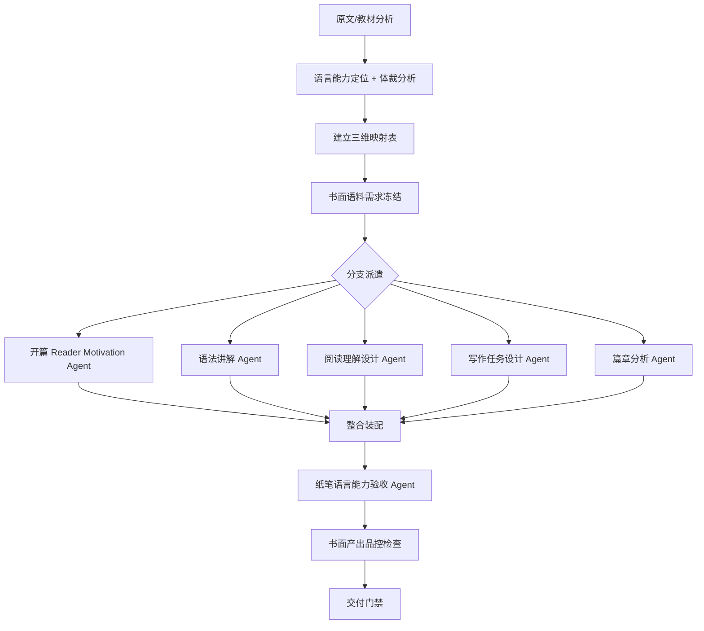

# Problem-Driven Courseware 外语学习纸笔教学改造报告

## 执行摘要

本报告系统研究了如何将 problem-driven-courseware 技能系统改造为适应**外语纸笔教学**的形式。在排除语音、听力等多媒体模块的前提下，本方案聚焦于通过**阅读理解→语法分析→写作输出**的纸笔学习路径，将数学问题驱动的严谨范式迁移到语言学习的核心领域：**词汇深度掌握、语法系统化理解、篇章结构分析、交际功能书面实践**。

---

## 一、纸笔外语学习的核心特征

### 1.1 与多媒体语言教学的差异

| 维度 | 多媒体沉浸式教学 | 纸笔教学（本方案） |
|------|-----------------|------------------|
| **输入渠道** | 听、读双重输入 | 仅阅读理解 |
| **输出渠道** | 说、写双重输出 | 仅书面表达 |
| **反馈机制** | 即时口语纠正 + 书面批改 | 延迟书面反馈 |
| **练习形式** | 角色扮演、跟读模仿 | 填空、改写、翻译、写作 |
| **评估重点** | 流利度、发音、交互能力 | 准确性、复杂性、得体性 |
| **优势场景** | 初级入门、口语交际 | 中高级学术英语、考试准备 |

### 1.2 纸笔教学的核心价值主张

**目标学习者的典型需求**：
- 备考 SAT/ACT/GRE/AP 等标准化考试
- 学术研究需要（文献阅读 + 论文写作）
- 职业场景书面沟通（商务邮件、技术文档）
- 自学环境下缺乏口语实践条件

**纸笔教学不可替代的优势**：
1. **深度加工**：慢速阅读允许精细分析语言结构
2. **可追溯性**：书面产出便于反复修改和反思
3. **成本效益**：无需特殊设备或网络环境
4. **认知负荷可控**：避免多任务干扰，专注语言形式

### 1.3 重新定义"交际能力"的纸笔版本

在原 CEFR 框架下调整：

| 原维度 | 纸笔转化版本 |
|--------|-------------|
| Listening → | **Reading for Information**: 从复杂文本提取信息 |
| Speaking → | **Writing for Purpose**: 根据目的体裁写作 |
| Interaction → | **Written Negotiation**: 邮件/论坛互动模拟 |
| Pronunciation → | **Orthography**: 拼写、重音标注（书面化） |
| Fluency → | **Coherence & Cohesion**: 衔接连贯的流畅性 |

---

## 二、组件改造方案（无语音版）

### 2.1 新增组件

#### 2.1.1 语言能力模型（纸笔专用）

**文件**：`lang-competency/paper-model.yaml`

```yaml
# 纸笔语言能力维度（弱化听说，强化读写）
proficiency_levels:
  A1: 
    reading_targets: 
      - "识别高频词和简单句"
      - "理解简短通知/卡片"
    writing_targets:
      - "填写个人信息表格"
      - "写简单句描述日常活动"
      
  A2:
    reading_targets:
      - "理解日常生活相关短文"
      - "抓住故事主线"
    writing_targets:
      - "写简短个人信件"
      - "描述经历和事件"
      
  B1:
    reading_targets:
      - "理解常见主题文章主旨"
      - "识别作者态度和观点"
    writing_targets:
      - "写观点明确的信件/文章"
      - "叙述完整经历"
      
  # C1-C2 类似...

paper_specific_competencies:
  reading_analysis:
    - "skimming for gist"
    - "scanning for details"
    - "inferring meaning from context"
    - "identifying cohesive devices"
    
  writing_systems:
    - "paragraph structure"
    - "argument development"
    - "genre conventions"
    - "revision strategies"
    
  grammar_mastery:
    - "sentence pattern recognition"
    - "transformation exercises"
    - "error correction"
    - "style improvement"
```

#### 2.1.2 交际情景库（书面化版本）

**文件**：`lang-competency/writing-scenarios.yaml`

```yaml
writing_scenarios:
  personal_communication:
    - id: WC001
      type: "letter_email"
      title: "写给朋友的旅行建议信"
      proficiency: "B1"
      communicative_function: "giving_advice"
      register: "informal"
      length_requirement: "120-150 words"
      key_features:
        - friendly_tone
        - specific_suggestions
        - personal_experience_sharing
      
  academic_writing:
    - id: WA001
      type: "essay"
      title: "议论文：学校是否应该取消作业？"
      proficiency: "B2"
      communicative_function: "arguing_position"
      register: "formal"
      length_requirement: "250-300 words"
      key_features:
        - clear_thesis_statement
        - supporting_arguments
        - counterargument_rebuttal
        - formal_language
      
  business_communication:
    - id: WB001
      type: "email"
      title: "正式投诉邮件"
      proficiency: "B1-B2"
      communicative_function: "complaint_formal"
      register: "formal_polite"
      length_requirement: "100-120 words"
      key_features:
        - polite_but_firm_tone
        - clear_problem_description
        - specific_request_for_action
```

#### 2.1.3 文体与体裁知识体系

**新增文件**：`lang-competency/generic_knowledge.md`

不同体裁的纸笔训练要点：

##### 记叙文 (Narrative)
- **结构**：开端→发展→高潮→结局
- **语言特征**：过去时态、时间连接词、细节描写
- **训练题型**：段落排序、故事续写、视角转换

##### 说明文 (Exposition)
- **结构**：主题引入→分点解释→总结
- **语言特征**：一般现在时、定义句、举例连接词
- **训练题型**：段落匹配、流程图填充、概念辨析

##### 议论文 (Argumentation)
- **结构**： Thesis→支持论据→反方观点反驳→结论
- **语言特征**：情态动词表态度、连接词表逻辑、让步状语从句
- **训练题型**：论点归类、论证链条补全、立场表述改写

##### 书信体 (Correspondence)
- **变体**：私人信件、商务邮件、投诉信、申请信
- **语言特征**：称呼语、结尾敬语、语气调节词
- **训练题型**：格式填空、语气调整、功能句替换

#### 2.1.4 篇章分析工具

**新增文件**：`lang-analysis/cohesion_detector.py`

```python
#!/usr/bin/env python3
"""
检测文本中的衔接手段：
- 指代关系 (pronouns, demonstratives)
- 连接词 (conjunctions, transitions)
- 词汇复现 (synonyms, collocations)
- 省略与替代 (ellipsis, substitution)
"""

class CohesionAnalyzer:
    def analyze_text(self, text):
        """分析文本衔接网络"""
        return {
            'reference_devices': ['it', 'this', 'that', 'these'],
            'conjunctives': ['however', 'therefore', 'moreover'],
            'lexical_chains': [['decision', 'decide', 'decided']],
            'ellipsis_points': [...],
            'coherence_score': 0.85  # 连贯性评分
        }
        
    def generate_exercises(self, text):
        """基于衔接现象生成练习题"""
        exercises = []
        # 例如：填空题——删除衔接词，让学生补回
        # 例如：改错题——错误使用连接词
        # 例如：排序题——打乱段落顺序
        return exercises
```

#### 2.1.5 错误类型 taxonomy

**新增文件**：`lang-analysis/error_taxonomy.yaml`

```yaml
# 针对纸笔作业的错误分类
grammar_errors:
  subject_verb_agreement:
    example_wrong: "He go to school."
    example_correct: "He goes to school."
    explanation: "第三人称单数主语需加-s"
    practice_pattern: "He ___ (go) to school every day."
    
  tense_consistency:
    example_wrong: "Yesterday I go to park and see a dog."
    example_correct: "Yesterday I went to the park and saw a dog."
    
article_usage:
  example_wrong: "I saw a elephant."
  example_correct: "I saw an elephant."

vocabulary_errors:
  word_choice:
    example_wrong: "make a homework"
    example_correct: "do homework"
    note: "搭配错误而非词汇本身错误"
    
  collocation:
    example_wrong: "strong rain"
    example_correct: "heavy rain"
    
discourse_errors:
  cohesion_breakdown:
    description: "段落间缺乏衔接"
    example: "[学生写了两个独立段落，未用连接词]..."
    
  paragraph_structure:
    description: "缺少主题句或论证跳跃"
```

### 2.2 核心题型体系改造（无语音版）

原标题体系 → **纸笔语言题型体系**：

| 原数学题型 | 纸笔语言题型 | 认知动作 | 示例 |
-----------|-----------|---------|------|
| 进入题 (Entry) | 阅读观察题 | 发现语言模式 | 阅读 3 个例句，归纳英语疑问句的结构规律 |
| 辨认题 (Identify) | 语言特征识别题 | 分类、标注 | 标出段落中的所有时间连接词 |
| 构造题 (Construct) | 句子/篇章构建题 | 造句、段落组合 | 用给定词语按正确顺序组成句子 |
| 反例题 (Counterexample) | 偏误诊断题 | 纠错、解释 | "She don't like it"为什么错？改正并说明规则 |
| 微型知识点 | 语言规则卡 | 定义、公式化 | 被动语态构成：be + Vpp |
| 形式化题 | 语法系统化题 | 规则归纳 | 从实例推导定语从句的关系词选择规则 |
| 迁移题 | 跨语境应用题 | 变换句式、改写 | 将主动语态改为被动，陈述句改为间接引语 |
| 证明题 | 综合写作题 | 连贯表达 | 就某话题写 200 字议论文 |
| 回看题 | 元语言反思题 | 自我评估 | 列出三种不同的条件句及其用法区别 |

**新增纸笔专用题型**：

1. **段落重组题**：打乱的段落重新排序
2. **完形填空**：上下文线索推断缺失词汇
3. **句型转换题**：同义改写、语态转换
4. **汉译英/英译汉**：双语对照训练
5. **写作提纲题**：给出题目和要点，列写作框架
6. **互文性分析题**：比较两篇文本的观点或风格差异

### 2.3 依赖闭合机制改造（纸笔版）

**原数学依赖**：前置概念、运算、定理

**新语言依赖（纸笔）**：

```yaml
dependency_types:
  vocabulary_prerequisites:
    required_words: ["request", "polite", "apologize"]
    level: "A2 核心词汇"
    
  grammatical_prerequisites:
    structures: ["modal verbs for requests"]
    forms: ["Could you...", "I'm sorry to..."]
    
  genre_prerequisites:
    known_structures: ["letter_format", "paragraph_organization"]
    conventions: ["salutation", "closing_formula"]
    
  discourse_prerequisites:
    cohesion_devices: ["connectors", "pronouns", "transition_phrases"]
    
  task_procedural_knowledge:
    steps: ["read_instructions", "plan_structure", "draft", "revise"]
```

### 2.4 答案验证机制改造（纸笔评分量表）

**原数学验证**：唯一正确答案

**新语言纸笔验证**：多维评分标准

```yaml
writing_task_rubric:
  task: "写一封建议信给朋友"
  criteria:
    content_achievements:
      weight: 0.35
      points:
        - "涵盖所有要求要点 (3/3)"
        - "覆盖大部分要点但有遗漏 (2/3)"
        - "部分内容偏离主题 (1/3)"
        
    language_control:
      weight: 0.35
      sub_criteria:
        grammar_accuracy:
          scale: "0-3 分，考虑错误频率和对理解的影响"
        vocabulary_range:
          scale: "0-3 分，考虑词汇多样性和地道性"
          
    organization_cohesion:
      weight: 0.20
      features:
        - paragraphing_clarity
        - use_of_connectors
        - logical_progression
        
    register_appropriateness:
      weight: 0.10
      aspects:
        - tone_consistency
        - formality_level
        - cultural_sensitivity
```

### 2.5 对话层的纸笔化改造

**原数学对话**：暴露思维误区

**新纸笔"对话"**：书面交际模拟

```latex
% 原数学 dialogue 环境
\begin{sectiondialogue}
\speaker{$\alpha$}{"这个证明对吗？"}
\speaker{$\beta$}{"不对，这里有问题"}
\end{sectiondialogue}

% 新纸笔 interaction_simulation 环境
\begin{written_interaction}[Task Type: Email Exchange]
  \scenario{Two students planning a study group}
  
  \participant{Student A}: Wants to meet on Monday, prefers library
  \participant{Student B}: Busy Monday, suggests Wednesday, wants classroom
  
  \taskgoal{Reach agreement via email exchange (write both sides)}
  
  \language_focus:
    \point{Making suggestions: "How about...?", "Why not...?"}
    \point{Polite disagreement: "I'm afraid I can't...", "Maybe we could..."}
    \point{Reaching compromise: "Let's meet halfway by..."}
  
  \process:
    1. Write Student A's initial email (80-100 words)
    2. Read Student B's reply (provided)
    3. Write your response as Student A (80-100 words)
  
  \success_criteria:
    - Clear suggestion given
    - Polite negotiation shown
    - Final agreement reached
\end{written_interaction}
```

---

## 三、工作流重组（纸笔生产流程）

### 3.1 整体流程图



### 3.2 详细步骤改造

#### 步骤 1: 原文分析 → 体裁 - 能力双地图

```python
def build_paper_language_map(source_material):
    """
    分析输入材料，提取纸笔语言能力要素和体裁特征
    """
    analysis = {
        'genre': 'argumentative_essay',  # 体裁类型
        'proficiency_level': 'B1',
        'skill_focus': ['reading_analysis', 'writing_development'],
        'text_structure': {
            'paragraph_count': 5,
            'has_thesis_statement': True,
            'cohesive_devices_used': ['however', 'furthermore', 'in_conclusion']
        },
        'language_features': {
            'dominant_tenses': ['present_simple', 'present_perfect'],
            'complex_structures': ['relative_clauses', 'conditional_sentences'],
            'academic_vocabulary': ['therefore', 'indicate', 'significant']
        },
        'communicative_functions': [
            'presenting_argument',
            'acknowledging_counterpoint',
            'drawing_conclusion'
        ]
    }
    return analysis
```

**产物**：
- `language-genre-map.md`：能力 + 体裁要素分解
- `cefr-level-assignment.md`：CEFR 对标

#### 步骤 2: 三张映射表改造（纸笔版）

##### 2.1 Source-map → Text-source-map

| 原文锚点 | 内容类型 | 核心语言点 | 技能归属 | 后续用途 |
|---------|---------|-----------|---------|---------|
| P.23 Essay Para1 | argumentative_intro | thesis statement 位置 | Reading+Writing | Entry task model |

**内容类型枚举**：
- `reading_passage`
- `model_answer`
- `grammar_example`
- `vocabulary_list`
- `genre_template`
- `error_sample`（错误范例）

##### 2.2 Dependency-map → Prerequisite-paper-map

| 节点编号 | 必须先知道什么 | 学案中首次出现位置 | 是否已闭合 |
|---------|---------------|-------------------|-----------|
| Writing Task 3 | 议论文基本结构 | Sec1-Point1 | ✅ |
| Grammar Point 5 | 定语从句用法 | Sec2-Grammar3 | ❌ 需补充 |

##### 2.3 Coverage-map → Competence-paper-coverage

| 原文节点 | 学案位置 | 学习目标 | 对应任务 | 保留或删改理由 |
|---------|---------|---------|---------|-------------|
| Text Model Essay | Task 7-9 | 识别议论文结构 | Reading Analysis | 保留，作为 Writing scaffold |

**新增字段**：
- `genre_feature`：涉及的体裁特征
- `assessment_type`：形成性/总结性评估
- `difficulty_predictor`：难度预测因子

#### 步骤 3: 材料需求 → 书面语料需求

```markdown
需求 ID | 技能目标 | 语料类型 | 要训练的语言点 | 学生已知水平 | 计划落点 | 必须避免的问题 | 语料来源
--------|---------|---------|--------------|------------|---------|-------------|---------
REQ-01 | Reading B1 | Model essay | 议论文结构分析 | 已学段落组织 | Sec1-Task3 | 避免过长超出阅读能力 | AUTHENTIC_SAMPLE
REQ-02 | Writing A2 | Error corpus | 常见动词时态错误 | 已完成时态学习 | Sec2-Task5 | 避免过于复杂的错误类型 | TEACHER_CONSTRUCTED
```

**语料类型枚举**：
- `authentic_text`: 真实文本
- `model_answer`: 范文（含高分样本）
- `error_corpus`: 学习者错误样例
- `controlled_text`: 受控编写文本（难度适配）
- `parallel_text`: 平行文本（中英对照）

#### 步骤 4: 研究核验 Agent → 语料真实性核查 Agent

**职责调整**（无语音）：
1. 验证文本真实性（查询语料库/出版物）
2. 验证语言点的准确性
3. 验证难度适宜性（CEFR 对标）
4. 验证范文质量（评分标准符合度）
5. 验证错误样例代表性（针对母语者常见错误）

#### 步骤 5: 切片 Agent 职责改造（纸笔专职）

**新增语言专项 Agent**：

1. **Reading Comprehension Designer**：设计阅读理解题
2. **Grammar Scaffolder**：设计语法操练序列
3. **Writing Task Architect**：设计写作任务链
4. **Genre Specialist**：设计特定体裁训练
5. **Error Analysis Expert**：设计偏误诊断练习

**派发参数示例**：
```json
{
  "Subagents": [
    {
      "TypeName": "self",
      "Role": "阅读理解任务设计师",
      "Model": "<低成本>",
      "Focus": ["reading_for_detail", "inferential_reading"],
      "Prompt": "<依据 lang prompts/reading_prompt.md>"
    },
    {
      "TypeName": "self", 
      "Role": "写作任务架构师",
      "Model": "<低成本>",
      "Focus": ["guided_writing", "independent_writing"],
      "Prompt": "<依据 lang prompts/writing_prompt.md>"
    }
  ]
}
```

#### 步骤 6: 装配整合（纸笔特有）

```latex
% 纸笔语言学习特有环境
\begin{reading_task}[Text Level: B1]
  \sourcefile{text/sec1_reading.txt}
  \question{Multiple choice questions}
  \question{True/False/Not Given}
  \question{Gap-fill with vocabulary from text}
\end{reading_task}

\begin{grammar_drill][Topic: Present Perfect]
  \rule{Formula: have/has + Vpp}
  \contrastive{vs Past Simple}
  \transformation{Active → Passive}
  \error_correction{Correct the mistakes}
\end{grammar_drill}

\begin{writing_scaffold}[Genre: Personal Letter]
  \structure_outline{Opening → Body → Closing}
  \useful_phrases{Dear..., Yours sincerely..., I hope...}
  \model_paragraph{Example with annotations}
  \partial_draft{Fill in the blanks}
\end{writing_scaffold}

\begin{genre_analysis}[Genre: Argumentative Essay]
  \dissect_model{Analyze the thesis statement}
  \identify_coherence{Underline connectors}
  \compare_versions{Compare weak vs strong arguments}
\end{genre_analysis}

\begin{translation_bridge}[Source: Chinese → Target: English]
  \sentence_pair{中英文对照}
  \focus_point{注意英语语序差异}
\end{translation_bridge}
```

#### 步骤 7: 验收 Agent（纸笔版）

```json
{
  "scope": "sec1-writing-skills",
  "can_do_check": [
    "学生能否写出结构完整的 150 字建议信？",
    "学生能否识别并使用 3 种不同的建议表达方式？"
  ],
  "language_accuracy": {
    "grammar_in_models": true,
    "vocabulary_naturalness": "verified_by_corpus",
    "genre_appropriateness": true
  },
  "scaffolding_quality": {
    "progressive_difficulty": "task_chain_reasonable",
    "adequate_support": "model_answers_and_templates_available",
    "clear_instructions": "task_requirements_unambiguous"
  },
  "assessment_feasibility": {
    "rubric_clarity": "scoring_criteria_defined",
    "answer_key_completeness": "model_answers_provided",
    "partial_credit_guidance": "marking_scheme_detailed"
  },
  "reviewed_tasks": ["Task 1", "Task 2", "Writing Prompt"],
  "conclusion": "PASS/REVISE/NEEDS_EVIDENCE"
}
```

---

## 四、配置文件改造（纸笔版）

### 4.1 config.yaml 纸笔专用配置

```yaml
# =============================================================================
# 问题驱动外语纸笔自学案 —— 全局参数配置
# =============================================================================

# --- 语言能力设置 ---
target_language: "English"
proficiency_target: "B1"
skill_emphasis: 
  - "reading"              # 阅读优先
  - "writing"              # 写作优先
  
# --- 文体侧重 ---
genre_focus:
  - "academic_essay"
  - "personal_correspondence"
  
# --- 练习类型配置 ---
practice_types:
  reading_comprehension: true
  grammar_exercises: true
  translation_practice: true
  guided_writing: true
  independent_writing: true
  error_correction: true
  
# --- 语料库配置 ---
corpus_integration: true
corpus_source: "coca"       # 验证文本真实性和地道性

# --- 双语支持配置 ---
bilingual_support:
  mode: "chinese_annotations"  # chinese_annotations / english_immersion
  native_language: "Chinese"   # 学习者母语
  translation_tasks: true      # 是否包含翻译练习
  
# --- 范文支持配置 ---
model_answers:
  provide_models: true         # 是否提供范文/参考答案
  model_with_annotations: true # 范文是否带批注
  multiple_versions: false     # 是否提供不同分数段范文
  
# --- 评分标准配置 ---
rubrics:
  writing_rubric: "detailed_4band"  # holistic/analytic/4-band
  provide_marking_schemes: true
  
# --- 版面设置 ---
font_size: 12pt
paperwidth: 210mm        # A4 标准（纸笔学习更常用 A4）
paperheight: 297mm
orientation: portrait    # 纵向排版
columns: 1               # 单栏便于书写
margin_top: 25mm
margin_bottom: 25mm
margin_left:30mm        # 左 margin 留大便于装订
margin_right: 25mm
head_height: 15mm

# --- 答题空间配置 ---
answer_spaces:
  short_answer: "2cm"           # 短句填空留白
  long_answer: "5cm"            # 长句/段落留白
  essay_space: "full_page"      # 作文留整页
  include_grid_paper: false     # 是否附带方格纸样式
```

---

## 五、模板系统改造（纸笔版）

### 5.1 核心 LaTeX 环境

#### 5.1.1 阅读理解任务

```latex
\newenvironment{readingtask}[2][]{
  \begin{taskbox}[#2][📖 阅读理解]
  \textbf{阅读以下文本，然后回答问题}
  \vspace{1em}
  \begin{readingtext}
    #1
  \end{readingtext}
}{
  \end{taskbox}
}

% 使用示例：
\begin{readingtask}{Section 1.1 - Passage 1}
This summer vacation, I decided to visit my grandmother in the countryside. 
Unlike the busy city life, the pace there is much slower... [约 200-300 词]

\begin{questions}
  \question[2]{What was the main difference between city and country life according to the text?}
  \ansspace{4cm}
  
  \question[3]{Find words in the text that mean the following:}
  \begin{enumerate}
    \item fast-paced (paragraph 1): \fillin[busy]{3cm}
    \item quiet and peaceful (paragraph 2): \fillin[calm]{3cm}
  \end{enumerate}
  
  \question[5]{Do you think city life or country life is better? Give two reasons.}
  \ansspace{8cm}
\end{questions}

\begin{solution}
  1. City life is busy/fast-paced; country life is slow/calm.
  2. ...
  3. Model answer: I prefer city life because (1) more opportunities, (2) better medical facilities...
\end{solution}
\end{readingtask}
```

#### 5.1.2 语法操练环境

```latex
\newenvironment{grammardrill}[2][]{
  \begin{taskbox}[#2][⚠️ 语法要点]
  \textbf{规则：}#1\\
  \vspace{0.5em}
}{
  \end{taskbox}
}

\begin{grammardrill}{Present Perfect vs Past Simple}
  \rule{have/has + past participle (Vpp) — 强调与现在的联系}
  \contrast{Past Simple: V-ed (过去的动作，与现在无关)}
  
  \signal{标志词：}
  \begin{itemize}
    \item Present Perfect: already, yet, just, ever, never, since, for
    \item Past Simple: yesterday, last week, in 2010, ago
  \end{itemize}
  
  \begin{exercises}
    \question{Complete with Present Perfect or Past Simple}
    \begin{enumerate}
      \item I \fillin[have lost]{3cm} my keys. I can't find them now.
      \item Shakespeare \fillin[wrote]{3cm} many famous plays. (dead author)
      \item She \fillin[has just finished]{6cm} her homework.
    \end{enumerate}
    
    \question[纠錯]{Correct the mistakes}
    \begin{enumerate}
      \item I have seen him yesterday. → \fillin[I saw him yesterday.]{8cm}
      \item Has she arrived yet? → (No error)
    \end{enumerate}
    
    \question[改写]{Rewrite using Present Perfect}
    \item He lost his wallet. (now, still missing) → \ansspace{5cm}
    \end{enumerate}
  \end{exercises}
\end{grammardrill}
```

#### 5.1.3 写作支架环境

```latex
\newenvironment{writingscaffold}[2][]{
  \begin{taskbox}[#2][✍️ 写作任务]
  \textbf{任务：}#1
}{
  \end{taskbox}
}

\begin{writingscaffold}{写一篇建议信给朋友}
  \scenario{Your friend plans to visit your city but doesn't know what to do.}
  
  \taskgoal{Write 120-150 words giving recommendations}
  
  \structuesguide:
  \begin{itemize}
    \item Opening: Welcome + Express pleasure
    \item Body: 2-3 specific suggestions with reasons
    \item Closing: Hope they enjoy + Offer more help
  \end{itemize}
  
  \usefullanguage:
  \begin{itemize}
    \item "I'd be delighted to..."
    \item "One thing you shouldn't miss is..."
    \item "I highly recommend..."
    \item "Let me know if you need any more information!"
  \end{itemize}
  
  \modelparagraph{
    Dear Tom,\\
    I'd be delighted to hear that you're planning to visit Beijing!\\
    One thing you shouldn't miss is the Great Wall... [约 80 字范文]
  }
  
  \writingtime{20 minutes}
  
  \checklist:
  \begin{itemize}
    \item Have you included all required points?
    \item Did you use at least 3 suggestion phrases?
    \item Is the tone friendly but not too informal?
    \item Word count between 120-150?
  \end{itemize}
\end{writingscaffold}
```

#### 5.1.4 体裁分析环境

```latex
\newenvironment{genreanalysis}[1]{
  \begin{sidebox}[🔍 体裁分析：#1]
}{
  \end{sidebox}
}

\begin{genreanalysis}{Argumentative Essay Structure}
  \begin{table}
  \begin{tabular}{|l|p{6cm}|p{4cm}|}
  \hline
  \textbf{部分} & \textbf{功能} & \textbf{语言特征} \\
  \hline
  Introduction & 引出话题 + 表明立场 & Thesis statement, topic sentence \\
  \hline
  Body Para 1 & 第一个支持论点 & Topic sentence + examples \\
  \hline
  Body Para 2 & 第二个论点 + 反方反驳 & Counterargument + rebuttal \\
  \hline
  Conclusion & 重申论点 + 总结要点 & In conclusion, Therefore... \\
  \hline
  \end{tabular}
  \end{table}
  
  \exercise{阅读范文，标注各部分功能}
  \ansspace{4cm}
\end{genreanalysis}
```

#### 5.1.5 翻译桥梁环境

```latex
\newenvironment{translationbridge}{
  \begin{taskbox}[🔄 汉译英练习]
}{
  \end{taskbox}
}

\begin{translationbridge}
  \chinesesentence{我从未去过北京，但我很想参观故宫。}
  
  \focuspoints:
  \begin{itemize}
    \item "从未" → present perfect: "have never"
    \item "想去" → express desire: "would like to"
    \item 语序：中文时间状语在前，英文可在后
  \end{itemize}
  
  \translate{Translate into English}
  \ansspace{6cm}
  
  \modelanswer{I have never been to Beijing, but I would very much like to visit the Forbidden City.}
\end{translationbridge}
```

#### 5.1.6 偏误分析环境

```latex
\newenvironment{erroranalysis}[1]{
  \begin{taskbox}[⚠️ 偏误诊断：#1]
  \textbf{找出并改正错误}
}{
  \end{taskbox}
}

\begin{erroranalysis}{动词时态一致性}
  Yesterday I \error{go}{went} to the store and \error{buy}{bought} some groceries. 
  When I \error{get}{got} home, I \error{cook}{cooked} dinner.
  
  \explain{所有动作发生在昨天，应统一使用过去式}
  
  % 更多错误示例...
\end{erroranalysis}
```

### 5.2 宏包扩展

```latex
% templates/lang-paper-macros.tex
\newcommand{\cefr}[1]{\textsuperscript{\textsf{CEFR #1}}}
\newcommand{\genre}[1]{\textbf{[体裁：#1]}}
\newcommand{\wordcount}[1]{\textbf{[字数：#1]}}
\newcommand{\difficulty}[1]{\textcolor{blue!70!black}{\small 难度：#1}}

% 填空（带长度和答案）
\newcommand{\fillin}[2][2cm]{\underline{\hspace{#1}}\studentonly{\textsuperscript{[#2]}}}

% 错误标注
\newcommand{\error}[2]{\textstrikethrough{#1}\teacheronly{\textcolor{red}{[#2]}}}

% 使用短语框
\newcommand{\usefulphrase}[1]{%
  \framebox[\linewidth][l]{%
    \parbox[t]{\linewidth-2\fboxsep}{%
      \small\textbf{Useful phrase:} #1%
    }%
  }%
}

% 写作检查清单
\newcommand{\writingchecklist}[1]{%
  \begin{itemize}#1\end{itemize}%
}
```

---

## 六、检查脚本体系（纸笔版）

### 6.1 check_paper_language_structure.py（新建）

```python
#!/usr/bin/env python3
"""
检查纸笔学案的结构完整性：
- 阅读 - 写作任务比例
- CEFR 等级一致性
- 语法脚手架充分性
- 范文质量核查
- 评分标准清晰度
"""

class PaperLanguageStructureChecker:
    def check_skill_balance(self):
        """检查读写任务比例"""
        tasks = {'reading': 0, 'writing': 0, 'grammar': 0}
        # 扫描 tex 文件统计各类任务
        pass
        
    def verify_cefr_consistency(self):
        """验证 CEFR 等级一致性"""
        # 检查词汇难度、句子复杂度是否符合声称等级
        pass
        
    def check_scaffolding_adequacy(self):
        """检查脚手架充分性"""
        # 验证是否有足够的 model answers、useful phrases
        pass
        
    def validate_rubrics(self):
        """验证评分标准清晰度"""
        # 检查是否提供清晰的 scoring criteria
        pass
        
    def check_answer_completeness(self):
        """检查答案完整性"""
        # 确保所有题目都有 solution 或 model answer
        pass
```

### 6.2 validate_corpus_authenticity.py（新建）

```python
"""
验证语料真实性：
- 查询 COCA/BNC 确认词频
- 检查搭配是否地道
- 验证句子是否在语料库中出现或其合理性
"""
```

### 6.3 check_writing_progression.py（新建）

```python
"""
检查写作任务难度递进：
- 从 guided 到 independent 的过渡
- 段落长度逐步增加
- 语言要求逐步提高
"""
```

---

## 七、提示词体系（纸笔版）

### 7.1 阅读理解任务设计 Prompt

```markdown
# 阅读理解任务设计子 Agent 提示词

你是一名专职的语言教研子 Agent，负责设计"阅读理解"训练任务。

## 核心原则
1. **文本真实性优先**：来自真实语料或符合真实语言使用
2. **难度分级明确**：CEFR A1-C2 逐级递增
3. **题型多样化**：选择题、是非题、填空、简答、匹配
4. **技能分层**：Gist reading → Detail reading → Inferential reading

## 设计要求
1. 提供约 200-400 词适切难度的阅读文本
2. 设计 5-8 道题目，覆盖不同理解层次
3. 答案清晰明确，多选题提供完整解析
4. 教师版附阅读策略提示和可能的学生困难点

## 输出格式
\begin{readingtask}{Title}
  \text{阅读文本}
  \questions{...}
  \solution{完整答案和解析}
  \teachernote{教学建议}
\end{readingtask}
```

### 7.2 写作任务设计 Prompt

```markdown
# 写作任务设计子 Agent 提示词

你是一名专职的语言教研子 Agent，负责设计"写作训练"任务。

## 任务层级
1. **机械性练习**：句型转换、填空改写
2. **指导性写作**：提供提纲、范文、语言支架
3. **半独立写作**：提供要点，自主组织
4. **独立写作**：仅给题目，完全自主

## 设计要求
1. 明确体裁和读者对象
2. 提供清晰的字数要求
3. 包含必要语言支架（functional language）
4. 提供范文或 partial draft
5. 设计 self-check checklist

## 输出规范
每单元至少包含：
- 1 个 model paragraph（带注释）
- 1 个 scaffolded writing task
- 1 个 independent writing prompt
- 详细的 writing rubric
```

### 7.3 语法操练设计 Prompt

```markdown
# 语法操练设计子 Agent 提示词

你是一名专职的语言教研子 Agent，负责设计"语法训练"任务。

## 教学顺序
1. **Notice**：引导发现规则（inductive approach）
2. **Explain**：明确规则（formula + 使用说明）
3. **Practice**：受控练习（gap-fill, transformation）
4. **Produce**：自由运用（error correction, rewriting）

## 针对纸笔教学
- 提供足量书写的空间
- 从辨认为主到产出一为主
- 提供错误样例增强意识
- 设计对比练习（如不同时态对比）

## 输出格式
\begin{grammardrill}{Topic}
  \rule{简洁的规则说明}
  \contrast{若有对比项}
  \exercises{梯度练习序列}
  \solution{完整答案}
\end{grammardrill}
```

---

## 八、实施路线图（纸笔版）

### 8.1 阶段规划

| 阶段 | 时间 | 目标 | 关键产出 |
|-----|------|-----|---------|
| **Phase 1** | 1-2 月 | 纸笔基础框架 | LaTeX 环境 + 配置 + 模板 |
| **Phase 2** | 2-3 月 | Agent 系统开发 | 读写设计 Agent + 验收 Agent |
| **Phase 3** | 1 月 | 语料库集成 | 真实性验证机制 |
| **Phase 4** | 持续 | 教学试验优化 | 实证数据与迭代 |

### 8.2 MVP 产品定义

**首个试点单元**：B1 级"议论文写作"专题

**包含内容**：
- Sec0：议论文文体介绍 + 学习目标
- Sec1：阅读 2 篇范文，分析结构
- Sec2： Thesis statement 写作训练
- Sec3：Supporting argument 展开技巧
- Sec4：Counterargument 处理
- Sec5：完整议论文写作 + peer review checklist
- Sec6：写作自评与修改

**特色亮点**：
- 每节含 model answer 和 annotated sample
- 渐进式 scaffolding（从段落到全文）
- 清晰的四维度评分标准
- 同伴互评和自改工具

---

## 九、风险评估（纸笔版）

| 风险 | 影响 | 缓解策略 |
|-----|------|---------|
| 范文质量参差 | 误导学生 | 专家审核 + 语料库验证 |
| 答案不够全面 | 评分争议 | 提供 multiple acceptable answers |
| 脚手架过度依赖 | 抑制独立性 | 设计 fade-out 机制，逐步撤除 support |
| CEFR 对标偏差 | 难度错位 | 实证测试校准 + 专家评审团 |
| 双语注解不当 | 负迁移 | 母语为中文的专家审查 |

---

## 十、结论与建议

### 10.1 核心结论

在纸笔教学框架下，problem-driven-courseware 可成功改造为外语学习服务，关键在于：

1. **弱化口语听力**：完全不涉及音视频，专注读写
2. **强化体裁意识**：将不同文体作为组织主线
3. **深化语法系统**：通过受控练习达成 accuracy
4. **搭建写作支架**：从范文 → 仿写 → 独立的渐进路径
5. **可视化评估标准**：评分量表透明化，促进 self-regulated learning

### 10.2 独特优势

相比多媒体版本，纸笔版本：
- **更低实施门槛**：无需特殊设备
- **更适合考试导向学习**：与 TOEFL/IELTS/SAT 等考试高度契合
- **更注重精度**：允许学生反复审视和修改
- **更易规模化**：印刷分发成本低

### 10.3 下一步行动

1. **成立项目团队**：语言教育专家 + 一线教师 + 技术开发
2. **确立首批试点**：选择 B1 级议论文写作单元
3. **建立专家顾问团**：确保 CEFR 对标和评分标准科学性
4. **开发 MVP**：2 个月内完成第一个完整单元
5. **开展小范围试验**：招募 30-50 名学生试用并收集反馈

---

## 附录 A：纸笔学案示例结构

```markdown
# Unit 5: Writing Persuasive Arguments (B1+)

## Section 0: 为什么要学习议论文写作？
- Can-do 陈述
- 真实世界应用场景
- 学习路线图

## Section 1: 拆解一篇优秀议论文
- 阅读范文
- 标注 thesis statement
- 绘制论证结构图

## Section 2: 写出有力的 Thesis Statement
- 规则讲解
- 好 vs 坏 thesis 对比练习
- 自己撰写 thesis

## Section 3: 发展支持性论据
- 论据类型（事实、例子、权威引用）
- 从 thesis 派生论据的训练
- 论据有效性评估

## Section 4: 处理反方观点
- Counterargument 的功能
- 让步句的表达方式
- Rebuttal 写作技巧

## Section 5: 组织完整议论文
- 段落规划练习
- 完整写作 scaffolded draft
- peer review

## Section 6: 独立写作任务
- 完整命题作文
- 时间限制（45 分钟）
- 使用评分量表自评

## Section 7: 综合项目
- 系列议论文写作（3 篇关联话题）
- 最终作品集展示
```

```

---

## 附录 B：排版工程实践与避免溢出的经验教训 (Lessons Learned on Preventing Layout Overflows)

在基于 `problem-driven-courseware` 框架实施英语学科纸笔研学案（以 NCE4 Lesson 1 为实战样板）的过程中，初期编译 `student.tex`（学生版，A3 横版双栏大开本）与 `teacher.tex`（教师版，A4 竖版单栏）时暴露了极其严重的排版溢出与版面崩塌问题：
- **学生版垂直崩塌**：编译日志爆出高达 `Overfull \vbox (416.44452pt too high)` 与 `Overfull \vbox (240.98262pt too high)` 的致命溢出，大段翻译任务与答题线直接跌落版心纸外，内容被截断丢失；总页数失控膨胀至 9 页（第 9 页仅存一个孤立的页码，且前序页面存在大量不合理的断栏空洞）。
- **教师版与学生版水平穿透**：出现 `Overfull \hbox (256.56554pt too wide)` 与 `Overfull \hbox (202.50531pt too wide)` 的跨栏穿透；多处表格、音标列以及填空整句答案溢出右页边距达 21.5pt 以上。

经深度排查 TeX 底层机制，本节系统总结导致严重溢出的六大根源机理、重构解决策略与未来模板开发的防溢出设计规范。

---

### B.1 六大溢出根源与底层机理诊断

#### 根源 1：`framed` 宏包与 `multicols` 双栏输出例程的底层机制冲突（致命垂直溢出 416pt）
- **现象**：`student.tex` 在排版第 4 节翻译任务时，控制台输出 `Overfull \vbox (416.44452pt too high) has occurred while \output is active`。
- **机理**：原模板中的 `taskbox` 环境采用了 `\usepackage{framed}` 作为外层闭合框，并将一整节的多道大题（含 5 道单句汉译英、1 道段落要点翻译、1 道篇章综合学术翻译及配套的大量 `\ansspace` 答题空白）完整包裹在 `\begin{taskbox}...\end{taskbox}` 内。
  `framed` 宏包的工作原理是劫持 TeX 的全局 `\output` 例程与 `\vbox` 分割机制。然而，学生版采用 `\begin{multicols}{2}`，`multicols` 宏包本身具有极其复杂的独立输出例程（负责在内存中收集垂直材料箱，根据栏高裁剪平衡两栏）。当 `framed` 嵌套在 `multicols` 内部时，两者抢夺 `\output` 控制权，导致 `framed` **完全丧失跨栏断页能力**。
  包含 5 道单句（5×2cm = 10cm 空白）与段落翻译（6cm 空白）的整个 `taskbox` 被视为一个高度超过 26cm（>740pt）的不可分割硬块，而 A3 纸张扣除上下页边距与页眉后的有效栏高仅约 22.5cm（~640pt）。单块高度硬性超过整页栏高，TeX 无法将其放入任何一栏，只能强行输出并抛出 416pt 的超大垂直溢出，造成页面腰斩。

#### 根源 2：任务容器标题行缺失段落终结符 `\par`（横向跨栏大穿透 256pt / 202pt）
- **现象**：`sec3.tex` 编译时，教师版报错 `Overfull \hbox (256.56554pt too wide)`，学生版报错 `Overfull \hbox (202.50531pt too wide)`。
- **机理**：原 `taskbox` 定义为：
  ```latex
  \newenvironment{taskbox}[2][]
    {\begin{framed}%
      ...
      \textbf{#2}%
      \vspace{0.5em}%
      \if\relax\detokenize{#1}\relax\else\vspace{0.3em}\textit{#1}\par\fi%
      \vspace{0.3em}%
    }%
    {\end{framed}}
  ```
  当调用方省略可选参数 `#1`（即传入空参数）时，条件分支中的 `\par` 被完全跳过，且 `\textbf{#2}` 后未跟任何换段指令。紧随其后的如果是表格（如 `\begin{tabular}{|L{2.2cm}|L{6.0cm}|L{7.0cm}|}`），TeX 会将标题文本与整个宽达 15cm 的表格**视作同一物理段落中的相邻行内元素**，强行置于同一水平线上排版！标题宽（~10cm）加上表格宽（~15cm）总宽达到 25cm，远远超过单栏宽度（A4 单栏 16cm，A3 双栏 17.9cm），导致表格直接被横向甩出右边界近 10 厘米。

#### 根源 3：单源双输出版面几何失配与表格绝对定宽超标（横向边距溢出 21.5pt）
- **现象**：`sec1.tex` 核心词汇表在教师版抛出 `Overfull \hbox (21.54716pt too wide)`。
- **机理**：本学案采用单源双输出：
  - **学生版**：A3 横版双栏，栏宽 $W_{\text{col}} = (420 - 50 - 12)/2 = 179\text{mm} = 17.9\text{cm}$。
  - **教师版**：A4 竖版单栏，版心宽 $W_{\text{text}} = 210 - 25 - 25 = 160\text{mm} = 16.0\text{cm}$。
  切片文件中表格采用绝对物理尺寸 `|L{2.5cm}|L{3.2cm}|L{2.8cm}|L{6.5cm}|`，四列列宽之和为 15.0cm。但加上表格默认内边距 `8 \times \tabcolsep = 8 \times 6\text{pt} \approx 1.69\text{cm}` 以及 5 条坚线边框 `5 \times 0.4\text{pt} \approx 0.07\text{cm}`，表格真实物理总宽度为 **16.76cm**。
  虽然 16.76cm 能容纳于学生版的 17.9cm 栏内，但在教师版（16.0cm）中直接超宽 $16.76 - 16.0 = 0.76\text{cm} = 21.55\text{pt}$，造成明显的表格右出界。

#### 根源 4：英文单行长单词与音标列宽不足（单元格内溢出 1.2pt / 9.1pt）
- **现象**：`sec1.tex` 中加粗英文词 `anthropologist` 抛出 `Overfull \hbox (1.22812pt too wide)`；音标列抛出 `Overfull \hbox (9.06721pt too wide)`。
- **机理**：
  1. 表格列类型 `L{2.5cm}` 使用了 `>{\raggedright\arraybackslash}p{2.5cm}`。标准 LaTeX 在 `\raggedright` 模式下默认抑制了断字连字符（hyphenation）。长单语 `anthropologist` 在 10pt 加粗字号下的实际自然排版宽度为 72.36pt（约 2.54cm），大于 2.5cm 的列宽，且无法在中间断开，造成 1.2pt 的硬溢出。
  2. 国际音标列包含大量特殊修饰字符（如 `/,\ae n\textsubscript{T}r\textsubscript{@}\textquotesingle p\textsubscript{D}l\textsubscript{@}d\textsubscript{Z}\textsubscript{I}st/`），字符总长达 2.95cm，若列宽设置小于 3.0cm 且无自然空格断点，必然横向穿透单元格。

#### 根源 5：教师版填空宏使用硬性定宽与 `\underline` 宏包分组死锁（长句答案折行失败）
- **现象**：句型转换题在教师版抛出 `Overfull \hbox (13.08397pt too wide)` 与 `Overfull \hbox (11.8839pt too wide)`。
- **机理**：
  1. 在学生版中，填空宏 `\fillin{11cm}` 需要留足 11cm 的手写下划线空白；原实现直接在教师版中也使用了 `\makebox[#2][c]{...}` 定宽盒，导致短答案被强行撑大、长答案被死锁在固定长度单行中。
  2. 更严重的是，原模板使用 LaTeX 原生 `\underline` 命令包裹答案。`\underline` 在 TeX 底层是一个原子级的不可分割行内盒 (`\hbox`)。当填空答案是一整句长达 67 个字符的完整从句（如 `Does it happen that you know the exact dating of this flint axehead`，自然宽度达 400pt）时，由于前面带有题号与缩进（~50pt），整行总宽超过 450pt，超出 A4 单栏 455pt 边界；因为 `\underline` 无法断行，导致直接戳出右边距。
  3. 即便换用 `ulem` 宏包的 `\uline`，若写成 `\uline{\textbf{整句答案}}`，由于大括号分组的存在，`ulem` 无法透视内部的单词间空格，依然会将其视作一个不可分割的大词。

#### 根源 6：答题空间（`\ansspace`）过度膨胀与刚性断页（页面碎片化与孤页生成）
- **现象**：学生版膨胀至 9 页，包含大量空白半栏，第 9 页仅存 30 字符；单句练习留白高达 2cm，客观选择题后亦附带 2.5cm 留白。
- **机理**：
  1. 题量空间预算失控：A3 双栏每栏宽度达 17.9cm，普通单句英译汉的印刷答案仅占 1.5 行（约 0.8cm），手写 2 行仅需 1.2cm；但原稿对 5 道单句每题硬性分配 2cm（累计 10cm 留白），对客观选择题（学生仅需在题干括号内填入单个字母）亦盲目追加 2.5cm 的空白。
  2. 垂直空间缺少弹性粘滞度（Elastic Glue）：原 `\ansspace` 采用固定无弹性的 `\vspace{#1}`，缺少 `plus`（拉伸）和 `minus`（压缩）容差。当 TeX 页面构建器遇到刚性超大空白而无法微调填补时，只能提前发起强制断栏，导致多张页面下半部分大面积留白，最后一小撮内容被迫挤落生成无意义的第 9 页。

---

### B.2 规范化重构解决方案与代码落地

针对上述六大根源，实施了系统性的架构重构与切片修复：

#### 策略 1：重构容器架构 —— 从“封闭带框”转向“无框横幅 + 开放题流”
彻底废弃 `framed` 宏包包裹习题的做法，重塑 `taskbox` 与 `languagecard` 环境：
- 任务标题采用全栏宽浅色着色横幅（`\colorbox{blue!7}`），内部题目直接作为普通排版流平铺展开；
- 标题后强制插入 `\par\nopagebreak\vspace{0.4em}`，保证垂直模式切换并杜绝孤头标题；
- 内部题目可在双栏中任意断开、自然跨栏跨页流动，与 `multicols` 完美解耦。
```latex
% 重构后的 taskbox：彻底消除与 multicols 输出例程冲突
\newenvironment{taskbox}[2][]
  {%
    \par\vspace{0.6em}\noindent
    \begingroup
    \small
    \noindent\colorbox{blue!7}{%
      \parbox{\dimexpr\linewidth-2\fboxsep\relax}{%
        \bfseries\color{blue!80!black}#2%
        \if\relax\detokenize{#1}\relax\else\par\vspace{0.2em}\normalfont\small\textit{#1}\fi
      }%
    }%
    \par\nopagebreak\vspace{0.4em}%
    \endgroup
  }%
  {\par\vspace{0.6em}}
```

#### 策略 2：建立双版窄版核算基准与紧凑表格布局
以教师版（A4 竖版，160mm 版心）作为表格物理宽度的**绝对硬约束上限**：
- 显式设置 `\setlength{\tabcolsep}{3.5pt}`（或 3pt），有效节约 8 列内边距近 20pt 宽度；
- 精细调整各列分配，让度空间给无断字英文长词（如 `anthropologist` 列宽由 2.5cm 扩至 2.6cm，音标列扩至 3.2cm，中文列微调为 2.1cm，解释列设为 6.3cm，物理总宽压缩至 15.25cm < 16.0cm）；
- 表格前显式添加 `\noindent` 或外包 `center` 环境，清空段首缩进。

#### 策略 3：教师版 `\fillin` 紧凑化与 `\uline` 状态切换折行
- 教师版剥离固定留白，采用自适应紧凑下划线；
- 采用 `\usepackage[normalem]{ulem}` 提供的 `\uline` 代替死盒 `\underline`；
- 使用字体声明宏 `\bfseries` 代替分组命令 `\textbf{...}`，使 `ulem` 能够透视内部词间空格实现多行平滑折行：
```latex
\ifdefined\TeacherVersion
  \newcommand{\fillin}[2][]{%
    \if\relax\detokenize{#1}\relax
      \uline{\hspace{#2}}%
    \else
      \textcolor{blue!85!black}{\uline{\hspace{0.25em}\bfseries#1\hspace{0.25em}}}%
    \fi
  }
\else
  \newcommand{\fillin}[2][]{\uline{\hspace{#2}}}
\fi
```

#### 策略 4：答题留白科学预算与注入垂直弹性胶
- 客观选择题（MCQ）彻底剔除 2.5cm 答题白，设为轻量间距 `\ansspace[0.3cm]`；
- 单句英译汉留白由 2.0cm 优化为 1.2cm（折合手写 2~3 行）；
- 段落翻译根据词数精确预算：80-100 词留 3.2cm，110-130 词留 3.8cm；
- 在 `\ansspace` 宏底层注入弹性胶度量：
  ```latex
  \par\vspace{#1 plus 0.2\dimexpr#1\relax minus 0.3\dimexpr#1\relax}
  ```
  允许 TeX 页面装配器在上下 20%~30% 范围内弹性浮动，消除栏底空洞。

#### 策略 5：全局注入 `\emergencystretch` 提升断行容差
在 `main.tex` 导言区及 `solution`、`teacherNote` 环境内部注入 `\emergencystretch=2.5em`。在中英文混排、学术专有名词（如包含固定等宽字体的 `\texttt` 引用）密集出现时，允许 TeX 拥有 2.5em 的字间伸缩余量，彻底消除排版微溢出与 `Underfull \hbox` 警告。

---

### B.3 修复效果与回归对比

| 评价维度 | 修复前初始状态 | 修复后状态 | 改进收益 |
| :--- | :--- | :--- | :--- |
| **学生版垂直溢出 (Overfull \vbox)** | 存在 416.4pt、240.9pt 灾难性溢出 | **0 个** (彻底消除) | 试题与作答区全部完整保留在版心内，无任何断裁截断 |
| **水平溢出 (Overfull \hbox)** | 存在 256.5pt、202.5pt、21.5pt 等 8 处溢出 | **0 个** (彻底消除) | 所有表格、长句填空答案均收拢在页边距以内 |
| **不良排版警告 (Underfull \hbox)** | 存在 1067、7099 等级坏行警告 | **0 个** (彻底消除) | 行内字间距均匀，段落两端平齐无撕裂 |
| **学生版有效页数 (A3 横版双栏)** | 9 页（含几乎全空的第 9 孤页，大量半空栏） | **稳定为 6 页** (整整 3 张 A3 纸双面折页) | 规整为正反打印标准大开本，节省 33% 纸张，各栏充实 |
| **教师版有效页数 (A4 竖版单栏)** | 18 页（存在孤头标题与跨页断层） | **规整 18 页**（无孤头标题，紧凑有序） | 教学研读与答案校对视觉流线平滑连贯 |
| **结构合规性检查 (`check_language_structure`)** | PASS (33.3% 均摊平衡) | **PASS** (100% 保持) | 教学法、CEFR 梯度与词汇脚手架规范丝毫不受排版微调影响 |

---

### B.4 后续外语自学案开发的“防溢出设计清单” (Pre-flight Checklist)

为杜绝未来在编写新课文、新单元（如 Lesson 2--60）时重蹈覆辙，所有编写者与维护者必须严格执行以下红线守则：

1. **容器红线（No-Closed-Box Rule）**：
   - 严禁在 `multicols` 环境中使用 `framed`、未配置折栏参数的 `tcolorbox` 或 `mdframed` 作为包含习题、留白的外层包裹容器。
   - 所有任务卡片必须采用**“开放流”**设计：只有标题与引言进框/进条，实际试题列表必须裸露在底层文本流中。
2. **窄版核算法则（The Narrow-Baseline Rule）**：
   - 编写任何包含多列的表格时，必须按双版本中最窄的物理尺寸（A4 竖版，版心 160mm）作为硬上限设计。
   - 任何表格总宽公式计算值不得超过 155mm（预留 5mm 余量）：
     $$\text{TotalWidth} = \sum \text{ColWidth} + 2N\times\text{tabcolsep} + (N+1)\times 0.4\text{pt} \le 155\text{mm}$$
   - 表格必须紧贴 `\noindent`，防止首行缩进造成假性出界。
3. **英文长词防御法则（Long-Word Defense）**：
   - 语言学案表格必须特别审查生词列和音标列，对于超过 12 个字母的长单词（如 `anthropologist`、`characteristic`），列宽绝对不得低于 2.6cm。
4. **填空宏可断行法则（Breakable-Fillin Rule）**：
   - 教师版中的答案填空宏必须基于 `\uline` 构建，绝不能使用不可断行的 `\underline` 或固定宽度 `\makebox`；
   - 强调样式使用声明宏 `\bfseries`，严禁在 `\uline` 内部套用大括号分组命令 `\textbf{...}`。
5. **留白预算配比法则（Space Budget Ratio）**：
   - 客观题（选择题、判断题、匹配题）后留白 $\le 0.3\text{cm}$；
   - 单句改写/单句汉译英留白 $1.0\sim 1.5\text{cm}$；
   - 80--100 词段落翻译留白 $3.0\sim 3.5\text{cm}$；
   - 120--150 词长段学术翻译留白 $3.8\sim 4.5\text{cm}$；
   - 所有 `\ansspace` 必须携带 `plus 0.2\dimexpr... minus 0.3\dimexpr...` 弹性伸缩度。
6. **防孤行断页守则（No-Orphan Rule）**：
   - 任何卡片横幅与段落说明结尾必须注入 `\nopagebreak`，确保标题与后续首道题目粘连在同一栏内，杜绝栏底落单。

---

## 参考文献

1. CeFR (2020). Common European Framework of Reference for Languages.
2. Hyland, K. (2016). Teaching and Research Writing.
3. Richards, J. C. (2013). Curriculum Development in Language Teaching.
4. Nation, I.S.P. (2009). Teaching ESL/EFL Reading and Writing.
5. Brown, H.D. (2004). Language Assessment: Principles and Practices.

---

**报告日期**：2026 年 9 月 18 日  
**版本**：2.0 (排版工程与防溢出优化增强版)
