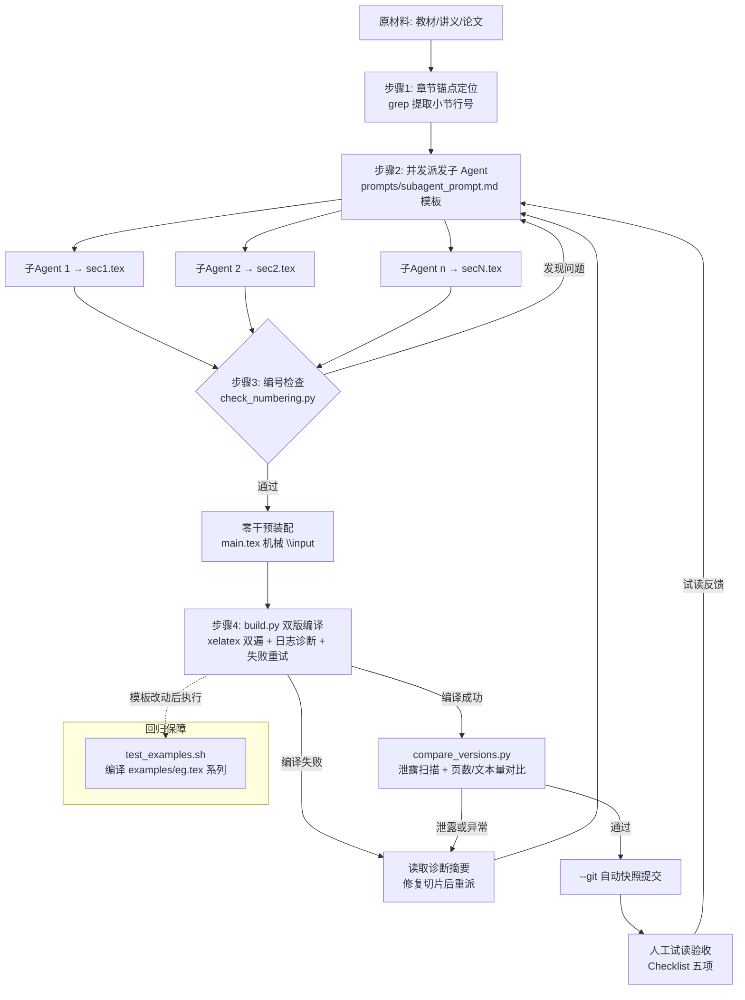

# 从数学材料制作“纯问题驱动”课件的工作流

本文档描述一种可重复的制作方法：输入可以是书的一章、论文、讲义或课件，输出是一套由问题主导的自学文稿，包括不带答案的学生版和带答案的教师版。`eg.tex` 与 `eg_solution.tex` 是本流程的参考样例：两者共享题目编号、章节顺序和图示，前者隐藏解答，后者在相同位置插入 `solution`/`proof`。

## 1. 先确定目标和边界

开始前写一页“教学契约”，明确：

- 学习对象、先备知识、预计学习时长，以及读者最终应能解决的任务；
- 本章范围和不处理的内容；
- 允许使用的工具（纸笔、计算器、CAS、编程、参考书）；
- 学生版是否允许翻看提示、是否需要书写空间；教师版需要“最终答案”还是还要给评分要点；
- 术语、记号、集合约定（例如自然数是否含 0），以及答案所需的严谨程度。

输出一个概念清单（定义、命题、例子、反例、方法、表示法）和依赖关系图。依赖关系决定题目的先后，而不是原材料的页码顺序。

## 2. 对原材料做“知识—证据—活动”拆解

逐段阅读材料，建立表格（可用电子表格或 Markdown）：

|字段|内容|
|---|---|
|概念 ID|稳定的短名称，如 `function`, `injective`|
|材料位置|页码、定理号、段落或幻灯片号|
|精确定义|必须保留的量词、类型和条件|
|典型例子|最小可计算例子|
|反例/边界|最容易误判的情况|
|前置依赖|学生必须先会什么|
|可观察证据|图、表、计算结果或实验现象|
|目标动作|识别、构造、计算、证明、推广或解释|

把原材料中的“讲解句”改写成待完成的活动，而不是简单删掉结论。例如，先给出几个 (N\to L) 的关系图，再让学生找出“每个定义域元素恰有一个像”；让学生比较 (x^3) 与 (x^2) 后自行说出单射条件；最后才给术语和形式定义。每个结论至少应有一个可检查的证据来源（计算、图示、反例或前面题目的结果）。

## 3. 设计问题链，而非题目清单

每个小节采用如下循环：

1. **进入题**：用熟悉对象、图示或一个可直接操作的例子暴露现象。
2. **辨认题**：分类、补空、判断、读图，确认学生看到了什么。
3. **构造题**：要求画图、列举、定义或给出一个例子。
4. **反例题**：改变一个条件，寻找失败原因和边界。
5. **形式化题**：把观察写成量词、符号或精确定义。
6. **迁移题**：换集合、换表示法或换一个函数，检验概念是否真正掌握。
7. **证明/综合题**：调用已建立的定义和结果，形成定理或结构。原材料中的整段证明必须拆成多问（明确目标 → 凑出关键步骤 → 收束结论），引导学生自己完成证明，而不是一次性要求复现全证。
8. **回看题**：用一句话概括判据，或说明本节结果如何支持下一节。

题目难度通常按“具体有限例子 → 无限/抽象对象 → 证明与推广”上升。相邻题目只引入一个主要新负担；若需要新记号，先安排一题让学生使用该记号。一道题含多个小问时，用嵌套 `enumerate` 排布各小问并标出依赖，**每一问各自紧跟 `\ansspace{...}` 留出相应书写空间**；不要把多个独立结论塞进同一小问。

## 4. 编写题目和微型知识点

每道题先写“题目规格”，再写面向学生的文字：目标概念、输入、动作、预期产物、可接受答案、常见错误、提示级别和后继题。题干应自洽地给出定义域/陪域、量词、约定和图例；不要依赖教师口头补充。

知识点只在学生已经遇到需要它的时刻出现，长度以能继续做下一题为准。常用形式是：一两句观察 + 一个术语或公式 + 立即可用的小题。不要提前给出本节最终定理，也不要用“显然”替代论证。

图示题必须同时说明图中对象的语义（行、列、箭头、坐标轴等）和学生要检查的性质。证明题应在前面铺设足够的定义和低门槛实例，并要求学生先写策略或关键等式，再给完整证明。

## 5. 组织章节和编号

按概念依赖组织若干无编号小节；题号在全章连续，便于学生引用和教师定位。若采用多文件协作或 AI 并发生成的模式，推荐使用 `enumitem` 宏包的跨环境编号功能：第一节使用 `\begin{enumerate}[series=probchain]`，后续各节使用 `\begin{enumerate}[resume=probchain]`，以保证物理文件分离时题号的绝对连续性。

每节开头可有一个极短的情境或图示，随后立即进入题目。章节末安排综合题，把早先题目的结论重新组合。

建议保留以下元数据（可写在源文件注释或单独 YAML 中）：题号、概念 ID、难度、题型、前置题号、材料出处、答案状态。这样可以自动检查漏题、重复编号和覆盖率，也便于材料更新后的局部重排。

## 6. 从单一源文件生成两个版本 (工程化文件组织)

采用“题目与解答同源、编译时切换”的原则。每题的答案紧跟题目写在 `solution` 或 `proof` 环境中；学生版通过条件宏隐藏这些环境，教师版显示它们。示意实现：

```latex
% 在导言区选择一个：
% \def\TeacherVersion{}
\ifdefined\TeacherVersion
  \newenvironment{solution}{\begin{proof}[\indent\bf 解]}{\end{proof}}
\else
  \excludecomment{solution}
\fi
```

更稳妥和工程化的做法是建立**模块化架构**（总是将新创作的文件置于单独的 `self/` 文件夹中，若无则新建，重名则询问）：
1. **独立输出目录 (`self/`)**：所有新生成的文件均位于 `self/` 目录中，与原材料及其他过程文件解耦。
2. **统一入口文件 (`main.tex`)**：仅包含导言区、排版版式声明、全局宏包定义，以及通过 `\input{sec1.tex}`, `\input{sec2.tex}` 等命令组合各章节核心内容。
3. **纯内容文件 (`sec*.tex`)**：只包含题目、解答与正文，无任何前言声明（`\documentclass` 等），方便多作者或 AI Agent 并行修改。
4. **版本包装文件 (`student.tex`, `teacher.tex`)**：包含极简的编译开关并 `\input{main.tex}`。学生版还应关闭答案中的提示性标签、评分和教师备注；教师版可增加“目标、关键步骤、常见错误、评分点”，但不要改变题目正文。

两版应共享题号、标题、图文件和记号。

## 7. 解答编写规范

答案按“结论—理由—必要计算/图示”的顺序写。判断题说明判据，构造题给出对象并验证，证明题明确使用的定义和量词。对存在性题给一个明确构造，对“不可能”题给出矛盾或计数理由。图示答案旁写出映射规则，避免只给图片。

每个答案都应标注其依赖的前置结论，并检查定义域、陪域和方向。例如复合映射必须核对中间集合；单射/满射必须区分“陪域”与“像集”；有限集结论不能未经说明地推广到无限集。发现原材料中的笔误、歧义或错误时，在教师版注明修订原因，并在学生版采用一致且自洽的表述。

## 8. 自动和人工质量检查

每次生成两版后执行：

1. **结构检查**：题号连续且无重复；每个概念清单都有对应题目；每个教师版答案都有题目；引用、图片路径和标签存在。
2. **数学检查**：随机抽取定义、边界例子、反例和证明逐项复算；检查量词、集合类型、复合顺序、特殊值（如 0、负数）和有限/无限条件。
3. **版本检查**：学生版 PDF 中不出现“解、证明、答案、评分”等内容；教师版题目正文与学生版逐题一致；两版页码、目录和图编号可定位。
4. **编译检查**：使用干净目录编译，至少运行 LaTeX 两遍；处理未定义引用、溢出、空白页、浮动图错位和 TikZ 裁切。可用 `latexmk`，并把 `.aux/.log/.out` 等中间文件放入构建目录。
5. **试读检查**：请一名没有看过答案的读者完成一小节，记录卡住的位置、歧义题干和所需时间；根据记录改题目链，而不是只增加答案篇幅。

## 9. 迭代和版本管理

每轮只改变一个主要变量（题目顺序、题干、提示或答案），保留变更记录：材料版本、题目增删、数学修订、试读反馈和 PDF 构建日期。用稳定的概念 ID 而不是页码追踪来源；题号变动时仍能生成“旧题号—新题号”对照表。发布前冻结记号和术语，分别归档源文件、图片、学生版 PDF、教师版 PDF 与构建日志。

## 10. 最小可复用模板

一个可迁移到任何学科的章节骨架如下：

```text
章节目标与先备知识
小节 A：现象图/数据 → 辨认题 → 构造题 → 反例题 → 定义
小节 B：直接应用 → 表示转换 → 迁移题
小节 C：多个结果的组合 → 证明题 → 综合题
章节回看：术语表、关键判据、未解问题或下一章入口
附录（教师版）：逐题解答、提示层级、常见错误、评分点、出处对照
```

用这套骨架处理新材料时，先完成概念—依赖表，再写三至五道最小问题链的原型并试做；原型通过数学和可学性检查后才扩展为整章。这样可以保持“问题驱动”是真正的学习路径，而不是把传统讲义的结论机械改成问句。

## 11. AI 智能体协作与并发生产工作流

当引入大语言模型或多智能体（Multi-Agent）协作时，按如下规范保证稳健性与高吞吐量：

1. **任务粒度切分**：不要让单一模型一次性处理过长的章节。首先使用文本搜索找出所有小标题的行号，然后按小节向多个子 Agent 并发派发任务。
2. **纯粹的内容生成**：在 prompt 中明确约束 AI “**不要输出任何导言区（`\documentclass`）内容**，直接从 `\section*{...}` 和正文/题目环境开始”。各 Agent 的输出直接保存为 `sec1.tex`、`sec2.tex` 等切片文件，最终由全局 `main.tex` 统一 `\input`，可彻底避免宏包冲突和格式杂糅。
3. **上下文环境衔接**：为确保并行生成的分节在汇总后题号连续，规定第一个 Agent 使用 `\begin{enumerate}[series=probchain]`，后续所有 Agent 使用 `\begin{enumerate}[resume=probchain]`。
4. **共享规范与模板对齐**：通过传递 `workflow.md` 核心原则和模板文件定义的宏命令给各个子 Agent，统一自定义宏（如 `\ansspace`，`\fillin[答]{宽}`，`\begin{teacherNote}` 以及 `\begin{microknowledge}`），降低后处理难度，实现零干预合并（Zero-intervention merge）。

### 11.1 流水线总览（Mermaid 流程图）



> 节点说明：`check_numbering.py`、`build.py`、`compare_versions.py`、`test_examples.sh`
> 均位于 Skill 的 `scripts/` 目录，可直接以 `python <脚本> <工作目录>` 调用。
